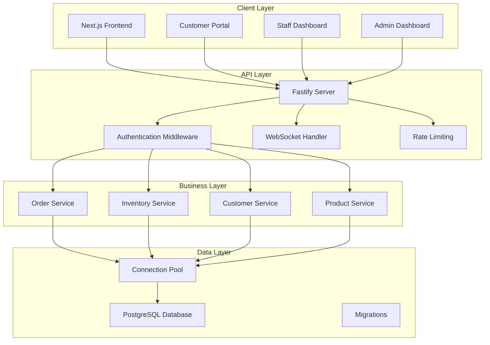
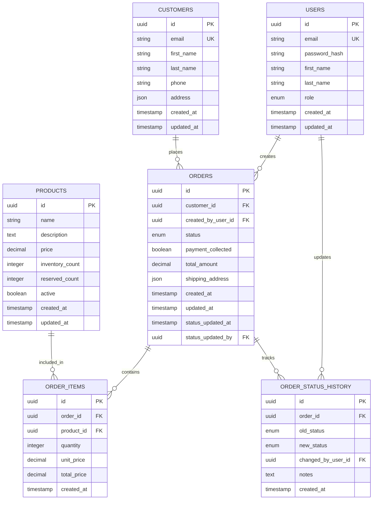

# Design Document - Order Management System

## Overview

The Order Management System (OMS) is a full-stack application built with a modern tech stack consisting of Next.js frontend, Fastify backend API, and PostgreSQL database. The system implements a three-tier architecture with clear separation of concerns, real-time capabilities, and comprehensive security measures.

### Key Design Principles
- **Separation of Concerns**: Clear boundaries between presentation, business logic, and data layers
- **Real-time Updates**: WebSocket integration for live order status updates
- **Security First**: JWT-based authentication with role-based access control
- **Scalability**: Modular architecture supporting horizontal scaling
- **Data Integrity**: ACID transactions and proper constraint enforcement

## Architecture

### High-Level Architecture



### Request Flow
1. **Authentication**: All requests pass through JWT validation middleware
2. **Authorization**: Role-based access control checks user permissions
3. **Rate Limiting**: Prevents abuse and ensures fair resource usage
4. **Business Logic**: Services handle domain-specific operations
5. **Data Access**: Repository pattern abstracts database operations
6. **Real-time Updates**: WebSocket broadcasts for status changes

## Components and Interfaces

### Frontend Components (Next.js)

#### Core Pages
- **Customer Portal** (`/customer`)
  - Order placement form with product selection
  - Order lookup by ID with real-time status
  - Responsive design with shadcn/ui components

- **Staff Dashboard** (`/staff`)
  - Internal order creation form
  - Order status management interface
  - Customer and product management

- **Admin Dashboard** (`/admin`)
  - Comprehensive order listing with pagination
  - Advanced search and filtering capabilities
  - CSV export functionality
  - System analytics and reporting

#### Shared Components
- **OrderCard**: Reusable order display component
- **StatusBadge**: Visual status indicator with color coding
- **ProductSelector**: Multi-select product picker with inventory validation
- **RealTimeUpdater**: WebSocket client for live updates
- **AuthGuard**: Route protection based on user roles

#### State Management
- **React Context**: Global state for authentication and user data
- **SWR/React Query**: Server state management with caching
- **Local State**: Component-level state for forms and UI interactions

### Backend API (Fastify)

#### Route Structure
```
/api/v1/
├── auth/
│   ├── POST /login
│   ├── POST /logout
│   └── GET /me
├── orders/
│   ├── GET /orders
│   ├── POST /orders
│   ├── GET /orders/:id
│   ├── PUT /orders/:id
│   └── PATCH /orders/:id/status
├── products/
│   ├── GET /products
│   ├── POST /products
│   ├── PUT /products/:id
│   └── DELETE /products/:id
├── customers/
│   ├── GET /customers
│   ├── POST /customers
│   ├── PUT /customers/:id
│   └── DELETE /customers/:id
└── reports/
    └── GET /orders/export
```

#### Service Layer Architecture
- **OrderService**: Handles order lifecycle, status transitions, inventory reservation
- **InventoryService**: Manages stock levels, reservations, and availability checks
- **CustomerService**: Customer CRUD operations and order history
- **ProductService**: Product catalog management
- **AuthService**: Authentication, authorization, and JWT management
- **NotificationService**: WebSocket broadcasting for real-time updates

#### Middleware Stack
1. **CORS**: Cross-origin request handling
2. **Helmet**: Security headers
3. **Rate Limiting**: Request throttling
4. **JWT Validation**: Token verification
5. **Role Authorization**: Permission checking
6. **Request Logging**: Audit trail with pino
7. **Error Handling**: Centralized error processing

## Data Models

### Database Schema



### Key Constraints and Indexes
- **Primary Keys**: UUID for all entities
- **Foreign Keys**: Proper referential integrity
- **Unique Constraints**: Email fields, order numbers
- **Check Constraints**: Status transitions, positive quantities
- **Indexes**: 
  - Customer email, order status, created_at timestamps
  - Composite indexes on (customer_id, created_at) and (status, created_at)
  - Full-text search indexes on customer names and product names

### Enums
- **UserRole**: `customer`, `staff`, `admin`
- **OrderStatus**: `placed`, `picked`, `shipped`, `delivered`, `cancelled`

## Error Handling

### Frontend Error Handling
- **Global Error Boundary**: Catches React component errors
- **API Error Interceptor**: Handles HTTP errors consistently
- **Form Validation**: Client-side validation with server-side backup
- **Toast Notifications**: User-friendly error messages
- **Retry Logic**: Automatic retry for transient failures

### Backend Error Handling
- **Custom Error Classes**: Domain-specific error types
- **Error Middleware**: Centralized error processing
- **Validation Errors**: Detailed field-level error messages
- **HTTP Status Codes**: Proper status code usage
- **Error Logging**: Structured logging with correlation IDs

### Error Types
- **ValidationError**: Input validation failures
- **AuthenticationError**: Invalid credentials or tokens
- **AuthorizationError**: Insufficient permissions
- **NotFoundError**: Resource not found
- **ConflictError**: Business rule violations (e.g., insufficient inventory)
- **InternalServerError**: Unexpected system errors

## Testing Strategy

### Frontend Testing
- **Unit Tests**: Component testing with React Testing Library
- **Integration Tests**: API integration and user flows
- **E2E Tests**: Critical user journeys with Playwright
- **Visual Regression**: Component visual consistency
- **Accessibility Tests**: WCAG compliance validation

### Backend Testing
- **Unit Tests**: Service and utility function testing
- **Integration Tests**: Database operations and API endpoints
- **Contract Tests**: API contract validation
- **Load Tests**: Performance under concurrent load
- **Security Tests**: Authentication and authorization validation

### Database Testing
- **Migration Tests**: Schema change validation
- **Seed Data Tests**: Test data consistency
- **Performance Tests**: Query optimization validation
- **Backup/Restore Tests**: Data recovery procedures

### Test Data Management
- **Test Fixtures**: Consistent test data setup
- **Database Seeding**: Automated test data generation
- **Cleanup Procedures**: Test isolation and cleanup
- **Mock Services**: External service mocking

## Security Considerations

### Authentication & Authorization
- **NextAuth.js**: Secure authentication provider integration
- **JWT Tokens**: Stateless authentication with proper expiration
- **Role-Based Access Control**: Granular permission system
- **Session Management**: Secure session handling
- **Password Security**: Bcrypt hashing with salt

### API Security
- **HTTPS Only**: TLS encryption for all communications
- **CORS Configuration**: Proper cross-origin request handling
- **Rate Limiting**: Request throttling per user/IP
- **Input Validation**: Comprehensive request validation
- **SQL Injection Prevention**: Parameterized queries only

### Data Protection
- **PII Handling**: Proper personal data protection
- **Data Encryption**: Sensitive data encryption at rest
- **Audit Logging**: Comprehensive action logging
- **Access Logging**: Request/response logging
- **Data Retention**: Proper data lifecycle management

## Performance Optimization

### Frontend Performance
- **Code Splitting**: Route-based code splitting
- **Image Optimization**: Next.js image optimization
- **Caching Strategy**: Browser and CDN caching
- **Bundle Analysis**: Regular bundle size monitoring
- **Lazy Loading**: Component and route lazy loading

### Backend Performance
- **Connection Pooling**: Database connection management
- **Query Optimization**: Efficient database queries
- **Caching Layer**: Redis for frequently accessed data
- **Response Compression**: Gzip compression
- **Database Indexing**: Optimized query performance

### Real-time Performance
- **WebSocket Optimization**: Efficient message broadcasting
- **Connection Management**: Proper connection lifecycle
- **Message Queuing**: Reliable message delivery
- **Scalability**: Horizontal scaling considerations

## Deployment Architecture

### Infrastructure Components
- **Frontend**: Vercel deployment with CDN
- **Backend API**: Railway/AWS deployment with load balancing
- **Database**: Managed PostgreSQL with automated backups
- **WebSocket**: Separate WebSocket service for real-time features
- **Monitoring**: Application and infrastructure monitoring

### Environment Configuration
- **Development**: Local development with Docker Compose
- **Staging**: Production-like environment for testing
- **Production**: High-availability deployment with monitoring
- **CI/CD Pipeline**: Automated testing and deployment

### Monitoring & Observability
- **Application Monitoring**: Performance and error tracking
- **Database Monitoring**: Query performance and health
- **Infrastructure Monitoring**: Server and network metrics
- **Log Aggregation**: Centralized logging with search
- **Alerting**: Automated incident detection and notification